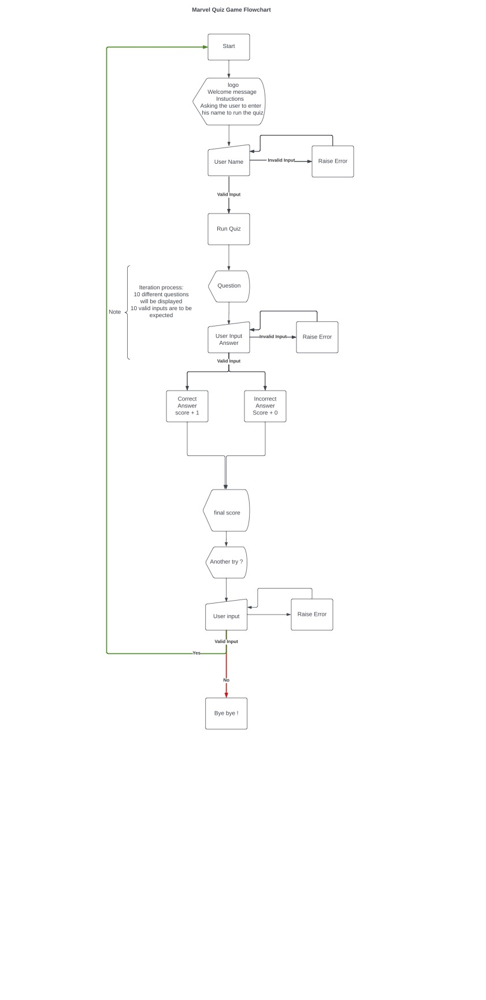
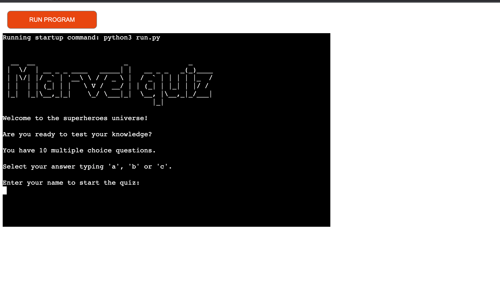
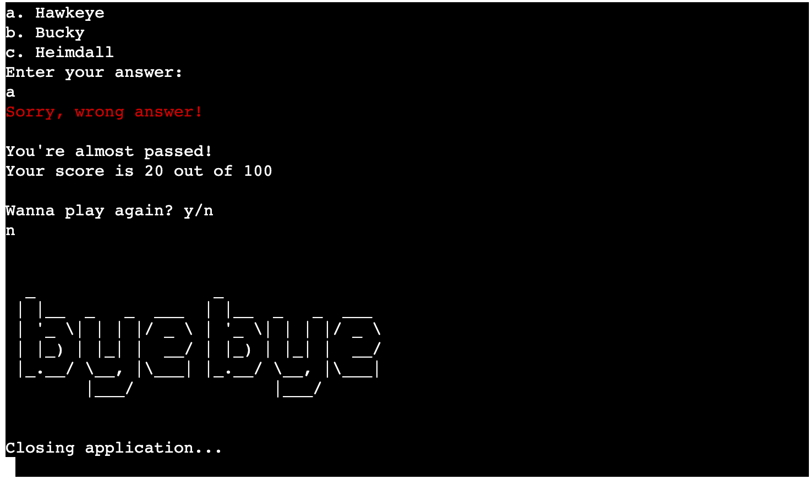
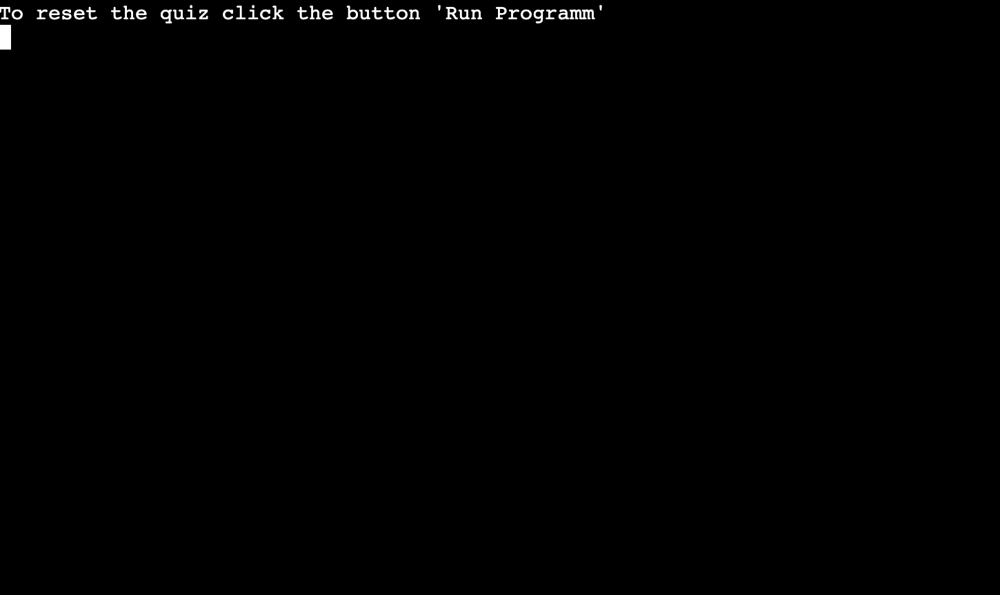
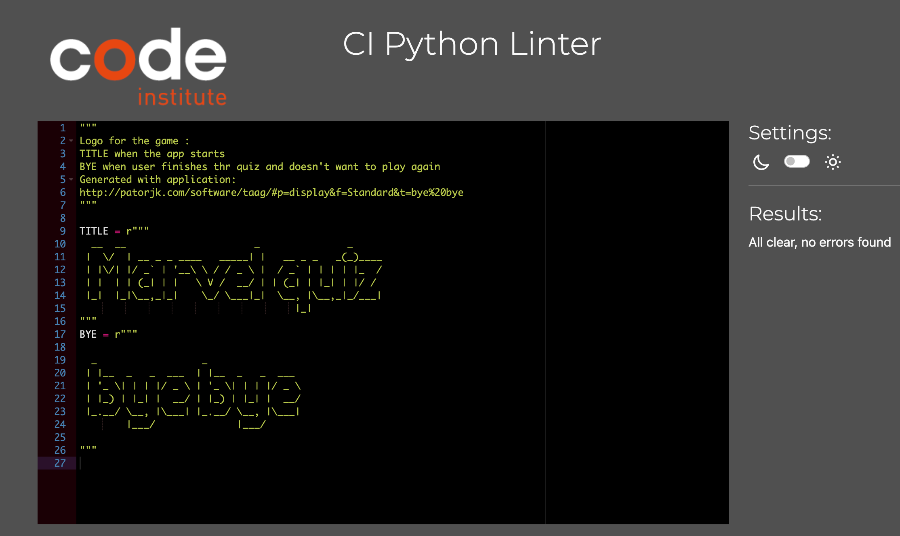
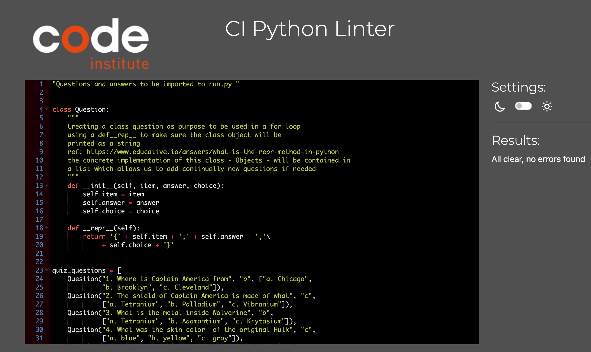
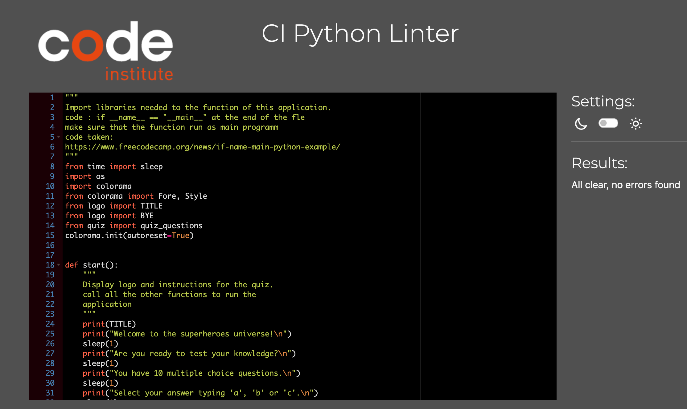

# Marvel Quiz

## Project Portfolio 3 - Full Stack Development 
##  Python Essentials
---

# Site Info

* The Marvel Quiz is a game is a simple straight forward quiz that suits everyone who'd like to test his/her marvel knowledge.
* This is my Project Portfolio 3 submission for Code Institute's Diploma in Web Application Development course.It is basic command-line application based on the programing language Python.
  - Live website [here](https://quiz-marvel.herokuapp.com/)
 ---

# Index – Table of Contents
* [User Experience (UX)](#user-experience-ux)
* [Features](#features)
* [Testing](#testing)
* [Deployment](#deployment)
* [Bug](#bug)
* [Credits](#credits)
---

# User Experience (UXD)

## Target Audiance
 
 - This project targets an inclusive audiance. The only prerequisites is a good comprehension of the english language.

## Objectives

 - Simple and entertainng quiz game application.
 - Clear inforamation delivered to proceed throught the game.
 - deliver a score at the end of the game.

## User stories

 - As a user I  can:

   - see a title indicating the purpose of the app
   - see clear, short, and concise instructions
   - enter his/her name to initiate the game
   - receive feedback when the name chosen isn't valid
   - receive an encouragement word to start the quiz when the name is valid
   - read clear questions with mutliple choice answer identified with the letter a, b and c
   - enter his answer using a, b. or c
   - recive a feedback when the answer is not valid
   - receive a feedback about the correctness of his/her answer
   - receive a score from 0 to 100 out of 100
   - reset the game for another play
   - quit the game 

## Technical Design
   
  - 

Flowchart

## Data Model

  - The application is based on three simple compartmentalised module.
  This helps to avoid overloading the main module run.py and makes the code easier to read. 
  The class structure in the quiz.py with the list quiz_questions allow us in the future to extend the number of question without readjusting other codes. 
  The main logic of the code is based on the iteration of a for loop in the list quiz_questions which takes its structure from the class Question. 
  The username’s  answer are compared to the solution contained in the quiz_questions list.
  To initiate the game, the user must fulfil the criteria fixed by the function validate_name. The database model is quite simple and linear.

  
  ---

 
# Features

## Existing Features

### Welcome & Instructions screen

 - Title indicating the purpose of the app
 - Short and concise instructions
 - Input name
 - 

Welcome Screen

### Username Feedback

 - Feedback when the name chosen isn't valid
 - Encouragement word to start the quiz when the name is valid
 - 

Invalid Name

 - 

Valid Name

### Questions & Choices

 - Clear questions with mutliple choice answer identified with the letter a, b and c 
 - 

Question and Choices

### Answer Feedback

 - Feedback when the answer is not valid
 - Feedback about the correctness of his/her answer
 - 

Invalid Answer

 - 

Positive Answer Feedback

 - 

Negative Answer Feedback

### Score & Play again choice

 - Score from 0 to 100 out of 100
 - 

Score

### Reset Game

 - Rest the game for another play
 - 

Play Again

 - 

Rest

 - 

Welcome Screen

### Quit Game

 - quit the game  processing
 - 

Quit Game

- 

Quit Game bis

### Features which could be implemented in the future

 - Expanding the size of the quiz according a difficulty level
 - Leaderboard where user can see his/her ranking and has acces to his/her an history of playerdata - Implementation a Google Spreadsheets for this purpose, to push and pull score data
 
 
 ---

## Testing

### Validation Code

  Code Institute's [Python Linter](https://pep8ci.herokuapp.com/) was used to check the correctness of the app's code. No error to be found.
   - 

logo.py

   - 

quiz.py

   - 

run.py

     

 

 ## Testing the user experience

| Feature | Expect | Action | Result |
| :--- | :--- | :--- | :--- |
| Welcome & Instructions screen| landing page shows a title and instructions | clicked live link | postive | 
| Feedback about unsername| enter a name. Username valid: good luck message | taped an alphabetic username | positive |
| Feedback about username | enter a name but not only with letter : username not valid. Another try | entered other keyboard but letter | positive |
| Question with multiple choice option | read a question three choice ordered under a, b and c | entered a name before the first question or answering a previous question | positive |
| Feedback when an answer not valid | when something else but a, b or c is typed as an answer. It is considered not valid | taped another letter but a, b or c | positive |
| Positive feedback when an answer correct | well done message when the right answer was typed | picked the right option btw a, b or c | positive |
| Negative Feedback when an anser not correct | sorry message when the wrong answer was typed | picked the wrong option btw a, b or c | positive |
| Score Display | when all questions are anwered appears the final score | answered all questions received a score out of  100 | positive |
| Play again | Being asked to play again and tpye "y" to validate: reset game | taped "y" | positive |
| Quit the quiz | Being asked to play again and tpye "n" to validate: Bye bye message | taped "n" | positive |
| Feeback when other choice but "y" or "n" | Being asked to play again and tpye something except "y" or "n" : invalid answer message | taped another choice | positive |

---

# Deployment

 - This application has been deployed by using the Heroku cloud platform. Before deploying with Heroku :
    - Remove un-used imports from run.py file.
    - Use the "pip freeze -> requiremnts.txt" command in the gitPod terminal; to save any libraries that need to be installed to the project files in Heroku.

1. Sign in to Heroku.
2. In Heroku account, go to Dashboard and click ‘Create New App’. Give the app a unique name and select region (Europe).
3. Click "New" and then click ‘Create App’.
4. Click on setting tab.
5. Click Reveal Config Vars.
6. Set the value of KEY to PORT, and the value to 8000.
7. Click ‘Add Buildpack’, select Python and click ‘Save Changes’.
8. Then select ‘NodeJS’ and click save again. IMPORTANT - Buildpacks should be in order. Python on top of NodeJS.
9. Click on ‘Deploy’ tab.
10. Select ‘GitHub' as deployment method.
11. Search for my Github repository name and then click “connect”.
12. Scroll down and click ‘Enable Manual Deploy’.
13. Once deployed, click ‘view’ to access deployed project.

---
 
 # Bug

| Bug | Fixed |
| :--- | :--- |
| Validate_name function output  couldn’t prevent the exclusion of special symbol for username, due to parameter constant good_input not working to filter only letter (based on exhaustive alphabetic list) | Solution: switch for am elif witn parameter not name.isalpha  |
| None print output by the function start, due to the constant TITle and its value print function * ASCII | Solution: remove the print function |
| play_again if statement logic: unbalanced syntax structure if with break, elif with return False : the else din't make sense and couldn't operate "invalid" message action   | Solution : replace the syntax with if with a break, if return False and if with paramater x != y and x != z |
| sleep function worked fine but couldn't prevent input before the questions and choices appeared and giving ouput to quick | Solution: remove all sleep function associated to near input function |
| if statement in a for loop could give a feedback once regarding an invalid choice answer but due to the input inside the if statement couldn't prevent to validate an invalid answer as a wrong answer | Solution: replace if statement by while to iterate the input and warining feedback until a, b or c is chosen |
| PEP8 linter: diverse trailing whitespace issues on ASCII import, and too long line issues regarding the list quiz_questions  | Solution: Remove trailing whitespace, wrap the long line of code properly |
 
 ---

 
# Credits 

### Technologie used

### Languages Used 
    - Python - To create a command-line application.

### Tools and Other Resources Used:

 - [Github](https://github.com/) -  for version control and pushing content to repository.
 - [Heroku](https://id.heroku.com/login) - for deployment.
 - [Gitpod](https://www.gitpod.io/)  -  for editting code.
 - [Love Sandwiches](https://github.com/bakrydiarra/love-sandwiches) - for inspiration and understanding practice in coding with the python.  
 - [W3 Schools](https://www.w3schools.com/) - for understanding Python's logic and syntax. 
 - [Lucid](https://lucid.app/users/login#/login) - for creating a flowchart.
 - [Python Linter](https://pep8ci.herokuapp.com/)- for validating python code.
 - [Patorjk.com](https://patorjk.com/software/taag/#p=display&f=Graffiti&t=Type%20Something%20) - for creating ASCII text.
 - [Bro Code](https://github.com/beratzorlu/python-quiz/blob/main/README.md#libraries) - for understanding the logic of a quiz game:
   - [QUIZ GAME written in Python](https://www.youtube.com/watch?v=zehwgTB0vV8)
   - [Python quiz game](https://www.youtube.com/watch?v=yriw5Zh406s)
 - [Dev.to How to build a Quiz Game in Python](https://dev.to/mindninjax/how-to-build-a-quiz-game-in-python-10ik) - or understanding the logic of a quiz game.
 - [Python: Print ascii art](https://www.youtube.com/watch?v=arcFqEuV_XQ) - for understanding the use of ASCII.
 - [Geeks for Geeks](https://www.geeksforgeeks.org/print-colors-python-terminal/) - for understanding the use of colors in python.
 

### Libraries

  - Local libraries:
    - os
    - sleep

  - Third party Library:
    - colorama

### Code Used
  
 - [Gitpod Full Template](https://github.com/Code-Institute-Org/python-essentials-template) -  used as a template for the gitpod environment.
 - [Python if __name__ == __main__ Explained](https://www.freecodecamp.org/news/if-name-main-python-example/) - used to make sure the function start run as main programm.
 - [W3docs](https://www.w3docs.com/snippets/python/how-to-clear-the-interpreter-console.html) - used to clear the screen.

### Content
 
 - The quiz content came from the source below:
   - [Parade](https://parade.com/1192384/alexandra-hurtado/marvel-trivia-quiz/)
   - [QuizBreaker](https://www.quizbreaker.com/marvel-trivia#)

- I wrote the multiple choice content.

## Acknowledgments

 - Many thanks to my Mentor Antonio Rodriguez for helpful feedback, industry insights and recommended tools.
 - Many thanks to my friends (Marjorie and Louise) and family for helping me testing the website and for their precious feedbacks.